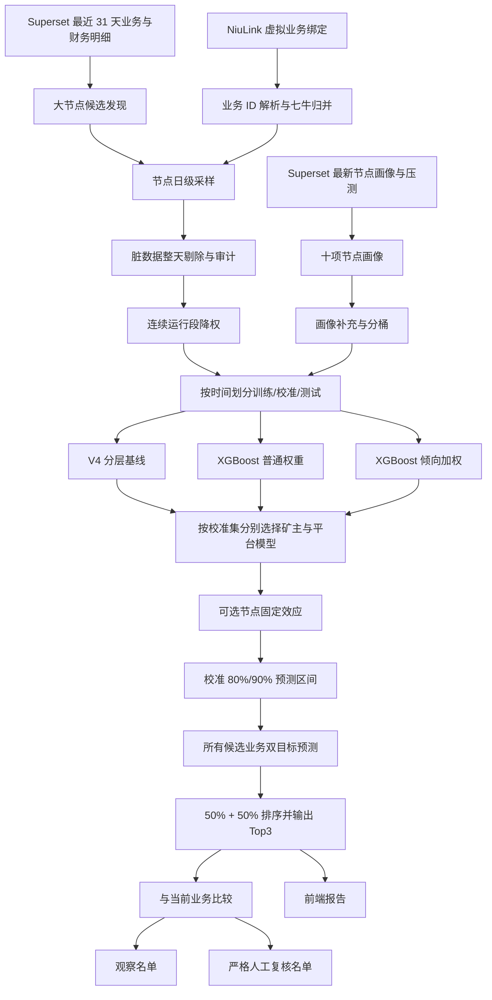

# 大节点业务推荐模型 V5 全流程说明

## 1. 文档目的

本文用于向产品、运营、数据、算法和研发同学完整说明当前大节点业务推荐项目的业务目标、数据来源、清洗口径、训练目标、算法选择、验证方法、推荐决策和可信度边界。

本文描述的是当前已经落地并完成离线验证的 V5 流程，不是理想化方案。文中的本轮数字来自：

- `recent_month_large_mainstream_v3_daily_weighted/v3_daily_training_summary.json`
- `recent_month_large_mainstream_v5_hybrid/v5_training_summary.json`
- `recent_month_large_mainstream_v5_hybrid/v5_model_comparison.csv`
- `recent_month_large_mainstream_v5_hybrid/v5_business_training_metrics.csv`
- `recent_month_large_mainstream_v5_hybrid/v5_recommendation_concentration.csv`

需要先明确一个结论：当前模型已经具备“按节点画像预测每个候选业务的矿主单位收益和平台单位利润，并输出 Top3”的能力，但目前只适合做人工决策辅助，不能据此自动切换现网业务。

## 2. 我们要解决的问题

### 2.1 新交付节点推荐

当一个大节点交付进来后，根据节点 ID 查询节点画像，再对所有满足训练门槛的主流业务分别预测：

1. 矿主日单位带宽收益。
2. 平台日单位带宽利润。
3. 两项目标各占 50% 后的综合排序。
4. Top3 业务、预估收益、原因、风险和证据覆盖度。

节点一次只交付一个业务，Top3 是给人工选择的候选列表，不代表同时部署三个业务。

### 2.2 存量节点重新匹配

对当前“在线、服务中、非机房、大节点”的节点池重新评分，并将当前实际业务与模型 Top1 比较，形成两份不同用途的名单：

- 观察名单：当前业务不等于模型 Top1，仅表示值得查看。
- 严格切换复核名单：不仅 Top1 不同，还要求推荐可信、预估差距足够大、Top1 的 90% 下界高于当前业务的 90% 上界。

当前流程不自动执行切换。最终决策仍由业务和运营人员完成。

### 2.3 当前明确不做的事情

- 不把专线、汇聚作为业务硬准入限制，两类节点都可以参与全部候选业务评分。
- 不使用非主流业务进行训练和推荐。
- 不分析真实业务切换前后的收益变化。
- 不把历史业务分配频率直接当作“最佳业务胜率”。
- 不把命中历史实际业务的 hit@1、hit@3 当作真实最优业务准确率。
- 不允许模型直接自动切换生产业务。

## 3. 核心业务口径

### 3.1 数据粒度

训练最小粒度为：

```text
node_id + sample_day + one canonical business
```

一条训练样本表示“某节点在某个自然日只运行一个可归属的主流业务时，该日产生的收益”。每一天相互独立，不再使用 7 天累计窗口。

部分历史兼容字段仍叫：

```text
cum_cost_7d
cum_revenue_7d
cum_profit_7d
```

当以下两个标记成立时，这些字段实际都是单日值：

```text
outcome_window_days = 1
outcome_grain = daily_single_active_business
```

因此读取训练文件时必须同时检查粒度标记，不能只根据旧字段名判断统计周期。

### 3.2 双目标定义

建设带宽记作 `B`，数据源字段是 `buildBandwidth`，单位为 Mbps。

矿主日单位带宽收益：

```text
miner_unit_income = cost_finalAmount / buildBandwidth
```

平台日单位带宽利润：

```text
platform_unit_profit = (revenue_finalAmount - cost_finalAmount) / buildBandwidth
```

其中：

- `cost_finalAmount` 已确认是矿主最终收益。
- `revenue_finalAmount - cost_finalAmount` 是平台利润。
- 分母使用节点信息里的建设带宽，不使用实际带宽、峰值带宽或 `peak95`。
- 预计日金额等于单位预测值乘以当前建设带宽。

在数据源金额单位保持一致的前提下，单位收益的量纲可以理解为“金额 / Mbps / 天”。

### 3.3 最终排序目标

模型先对同一节点的全部候选业务分别预测两个单位收益，再在该节点自己的候选业务集合内做 Min-Max 归一化：

```text
miner_score(b) = (pred_miner(b) - min_pred_miner) /
                 (max_pred_miner - min_pred_miner)

platform_score(b) = (pred_platform(b) - min_pred_platform) /
                    (max_pred_platform - min_pred_platform)

combined_score(b) = 0.5 * miner_score(b) + 0.5 * platform_score(b)
```

如果某个目标下所有业务预测完全相同，该目标的归一分统一取 0.5。

综合分只用于同一个节点内部排序。不同节点的 `combined_score` 不应直接横向比较，因为每个节点的归一化上下界不同。

## 4. 端到端流程



## 5. 数据获取流程

### 5.1 数据源总表

| 数据源 | 主要字段 | 用途 | 是否进入 V5 特征 |
|---|---|---|---|
| `test.node_day_ops_wide_full` | `day`、`nodeId`、`customerId`、`state`、`stage`、`buildBandwidth`、地域、运营商、NAT、调度、收入、成本 | 日级业务事实、收益标签、当前业务快照 | 部分字段进入 |
| `jarvis.node_analysis_data` | 节点状态、阶段、供应侧类型、带宽、CPU、内存、磁盘、IPv6、NAT | 大节点识别、节点画像、当前节点池 | 白名单字段进入 |
| `jarvis.node_join` | 标称画像、设备画像、最新上报、`netbenchresults` | 大节点候选补充、画像补充、最新压测结果 | 白名单字段进入 |
| `jarvis.dial_acc` | 拨号账号及拨号状态 | 上游属性流程兼容 | 当前 V5 不进入 |
| NiuLink `/customers/virtual` | 虚拟业务及关联真实业务 | 虚拟业务解析 | 不作为数值特征 |
| NiuLink `/customers` | 真实业务 ID 和名称 | 业务名称及绑定补充 | 不作为数值特征 |

Superset 查询通过项目里的 `SupersetSQLClient` 执行，只做 `SELECT`。认证信息从本机环境读取，不写入代码和产物。

### 5.2 最近一个月窗口

当前标准窗口是最近 31 个完整数据日。脚本先查询：

```sql
SELECT MAX(day)
FROM test.node_day_ops_wide_full
```

然后从最新完整日向前取 31 天。当前 V5 本轮使用：

```text
全量窗口: 2026-08-02 至 2026-09-01
训练窗口: 2026-08-02 至 2026-08-25
校准窗口: 2026-08-26 至 2026-08-28
最终测试: 2026-08-29 至 2026-09-01
```

时间切分必须使用自然日，不能随机拆行，否则同一节点相邻日期的信息会同时进入训练集和测试集，造成效果虚高。

### 5.3 大节点候选发现

训练候选取 `node_join` 与 `node_analysis_data` 两套规则的并集，并按节点 ID 首字符分片查询。

`node_join` 候选规则：

```text
deliverytype in {idc, dedicated}
OR resourcetype = dedicated
```

`node_analysis_data` 候选规则：

```text
resourcetype = dedicated
OR supplysidedeliverytype in {机房, 专线}
OR supplysidedeliverytype = 汇聚 且 max(bandwidth, actualbandwidth) >= 100
OR max(bandwidth, actualbandwidth) >= 1000 且 corenum >= 8
```

在属性合并后还会再次运行大节点识别，明确排除 `smallBox`、`小盒子`、`droid`、`h618`、`aml`、`n1`、`openwrt` 等小盒子信号。

需要注意：训练数据的大节点范围可以包含机房或专线节点；当前存量重匹配的目标范围额外排除了机房。V5 不使用“机房、专线、汇聚”作为预测特征，也不据此限制候选业务。这一训练人群与应用人群的差异属于当前已知限制。

### 5.4 当前待评估节点池

当前节点池从 `node_analysis_data` 最新快照生成，必须同时满足：

```text
state = online
stage = inService
supplysidedeliverytype not in {机房, 小盒子}
不是已知小盒子交付类型
满足大节点资源或容量规则
```

本轮进入 V5 报告的当前节点数为 `6,933`。

### 5.5 当前业务获取

当前业务以 `node_day_ops_wide_full` 最新完整日为准。本轮快照日为 `2026-09-01`。

只接受同一节点同一天能够唯一归一到一个业务的快照，来源标记为：

```text
current_business_source = wide_daily_online_inservice_single_canonical_business
current_business_confidence = authoritative_daily_active_snapshot
```

当前业务无法唯一识别时保持未知，不根据推荐结果反推当前业务。

### 5.6 虚拟业务绑定获取

虚拟业务通过 NiuLink 管理接口读取：

```text
GET /api/proxy/jarvis/v1/customers/virtual
GET /api/proxy/jarvis/v1/customers
```

认证值只允许放在环境变量 `NIULINK_AUTH` 中。导出文件只保存业务 ID、业务名称、签约方和绑定模式，不保存认证信息。

绑定模式保留为审计信息：

```text
0 = normal
1 = accept
2 = price
```

虚拟业务不能只凭“存在绑定”就随意映射。系统按以下证据优先寻找唯一真实业务：

1. 当天存在财务金额的关联真实业务。
2. 当天处于 `online + inService` 的关联真实业务。
3. `vendorSuggestCustomersName` 中出现的关联真实业务。
4. 没有当天证据，但该虚拟业务只绑定一个允许业务。

如果仍然有多个可能业务，则整天标记为虚拟绑定歧义并剔除。

### 5.7 最新压测丢包满意度

当前只使用每个节点最新一次整体压测丢包满意度，不使用每条线路单独结果。

数据来自：

```text
jarvis.node_join.nodeinfo.netbenchresults
```

同一节点按 `hour DESC, lastreporttime DESC` 取最新记录。优先计算：

```text
overall_packet_loss_satisfaction_pct =
    100 * sum(lineresult.limitbw) / sum(lineresult.expectedbw)
```

结果限制在 `[0, 100]`。当线路 `expectedbw` 无法求和或为 0 时，回退到 `limitbwachieverate`。

本轮：

- 最新压测总文件覆盖 `13,236` 个节点。
- 训练样本压测字段覆盖率为 `99.77%`。
- 当前报告节点压测覆盖率约为 `99.21%`。

重要限制：当前把一份最新压测静态值复用到该节点过去 31 天的全部训练样本，没有按历史日期重建压测快照。因此收益标签做到了时间切分，但压测特征尚未做到严格的 as-of 时间对齐。这会产生一定的未来信息风险，不能把当前验证结果解释为完全无泄漏的线上效果。

## 6. 业务池与业务归一

### 6.1 主流业务白名单

业务池只接受 `mainstream_business_allowlist.csv` 中的原始业务 ID。当前共有 `50` 个原始 ID，其中七牛有多个真实或虚拟 ID。

除七牛外的 29 个主流业务名称为：

| 品牌 | 业务名称 |
|---|---|
| 字节 | 字节CDN专线、字节CDN专线V4、字节CDN小盒子、字节CDN汇聚、字节CDN汇聚V2、字节CDN汇聚V3、字节架构专线、字节架构专线V3、字节架构汇聚、字节架构汇聚V2 |
| 百度 | 百度XCDN、百度小度 |
| 优酷 | 优酷专线、优酷汇聚 |
| 快手 | 快手严选、快手点播、快手直播 |
| 腾讯 | 腾讯专线、腾讯专线-80、腾讯云主机、腾讯内网全锥直连、腾讯汇聚P2P、腾讯汇聚直连 |
| 爱奇艺 | 爱奇艺 |
| B站 | B站Web盒子、B站专线-mp、B站专线-盒子、B站专线-盒子V2、B站盒子 |

### 6.2 七牛统一口径

七牛相关原始或虚拟业务统一归并为：

```text
canonical business ID = 10000280
canonical business name = 七牛CDN-ZJ月95
```

多个七牛原始 ID 在同一天最终归到同一 canonical ID 时，不算“同一天多个业务”。无法唯一归属的七牛财务行仍会触发整天剔除。

### 6.3 为什么最终只有 20 个候选业务

“白名单里的业务数”和“本轮可以训练推荐的业务数”是三个逐步收缩的口径：

```text
50 个原始白名单 ID
-> 七牛归一后约 30 个逻辑业务
-> 最近 31 天实际观测到 26 个逻辑业务
-> 训练时间段达到支持门槛的候选业务 20 个
```

候选门槛在训练窗口上计算，而不是在整个 31 天上计算：

```text
train_effective_support >= 30
AND train_unique_nodes >= 20
```

因此某业务全月看起来有 30 条以上有效支持，也可能因为它主要在校准或测试阶段出现而不能成为候选。

本轮 20 个候选业务：

| 业务 ID | 业务名称 | 全月有效支持 | 覆盖节点 |
|---|---|---:|---:|
| 10000000 | 腾讯汇聚直连 | 129.0 | 109 |
| 10000003 | 百度XCDN | 199.0 | 165 |
| 10000019 | B站盒子 | 2,360.2 | 1,682 |
| 10000034 | 优酷专线 | 140.0 | 119 |
| 10000041 | B站Web盒子 | 111.0 | 96 |
| 10000064 | 百度小度 | 323.0 | 262 |
| 10000065 | B站专线-mp | 126.0 | 121 |
| 10000069 | 腾讯汇聚P2P | 2,600.0 | 1,265 |
| 10000079 | 字节架构汇聚V2 | 3,629.0 | 2,786 |
| 10000088 | 字节CDN汇聚V2 | 221.0 | 197 |
| 10000096 | 字节架构专线V3 | 323.0 | 286 |
| 10000183 | B站专线-盒子 | 652.0 | 573 |
| 10000191 | 腾讯专线-80 | 58.0 | 57 |
| 10000244 | B站专线-盒子V2 | 1,859.0 | 1,597 |
| 10000280 | 七牛CDN-ZJ月95 | 3,130.1 | 2,804 |
| 10000304 | 快手严选 | 1,007.0 | 863 |
| 1380317970 | 快手点播 | 242.0 | 225 |
| 1381526443 | 爱奇艺 | 112.0 | 97 |
| 1382649737 | 腾讯专线 | 228.0 | 211 |
| 1382680008 | 字节CDN专线 | 282.0 | 240 |

最近一个月有观测、但没有通过训练期门槛的 6 个业务为：

| 业务名称 | 全月有效支持 | 全月节点数 | 未进入候选的主要原因 |
|---|---:|---:|---|
| 字节CDN专线V4 | 35 | 35 | 训练期支持不足，出现时间偏晚 |
| 快手直播 | 24 | 19 | 有效支持和节点数不足 |
| 字节架构汇聚 | 20 | 18 | 有效支持和节点数不足 |
| 优酷汇聚 | 17 | 11 | 有效支持和节点数不足 |
| 字节CDN汇聚V3 | 4 | 2 | 样本极少 |
| 字节CDN汇聚 | 1 | 1 | 样本极少 |

未被观察到或没有达到门槛的主流业务不会作为本轮推荐候选，模型不会为完全没有证据的业务编造收益。

## 7. 日级逻辑处理与数据清洗

### 7.1 原始数据查询

第一步先找出窗口内至少存在一条 `online + inService` 业务记录的节点日，然后取回这些节点日上的全部业务行。取全部行的原因是需要检查是否同时存在其他业务或无法归属的财务金额。

核心字段包括：

```text
nodeId, day, customerId, customerName, state, stage,
buildBandwidth, province, city, isp, natType,
resourceType, deliveryType,
cost_finalAmount, revenue_finalAmount, peak95,
transProvRate, scheduleISPs,
vendorSuggestCustomersName, virtualCustomersName,
snapshotTime, updatedTime
```

Superset 单次结果上限按 `10,000` 行处理。批次命中上限时会自动将节点集合对半拆分重查；如果单节点仍达到上限则报错，不静默截断。

### 7.2 活跃业务定义

一条业务记录只有同时满足以下条件才算当天活跃：

```text
LOWER(state) = online
AND LOWER(stage) = inservice
```

仅有金额但不是活跃状态的行，仍会参与财务归属检查，但不能单独决定当天运行的业务。

### 7.3 一天一个业务的清洗契约

按 `node_id + sample_day` 分组后，依次执行以下排除规则。规则有先后顺序，一个节点日只记录优先命中的第一个状态：

1. 活跃虚拟业务无法唯一绑定到真实主流业务。
2. 没有任何活跃主流业务。
3. 同一天存在两个及以上 canonical 主流业务。
4. 主流和非主流业务同一天并行。
5. 建设带宽缺失或不大于 0。
6. 同一天出现多个不同的正建设带宽。
7. `transProvRate` 不是空、0 或 100。
8. 同一天同时出现 0 和 100 两种跨省值。
9. 存在非零财务行，但无法归属到当天选中的业务。
10. 当天选中业务的成本和收入同时为 0。

任何一条命中都会剔除整个节点日，不做行级拼凑或均摊。

### 7.4 本轮清洗结果

| 项目 | 数量 |
|---|---:|
| 大节点候选 | 41,039 |
| 原始业务行 | 505,613 |
| 原始节点日 | 360,324 |
| 清洗通过节点日 | 279,443 |
| 清洗剔除节点日 | 80,881 |
| 节点日通过率 | 77.55% |
| V5 再剔除混合调度行 | 133 |
| V5 最终训练行 | 279,310 |

主要排除原因：

| 状态 | 节点日数 |
|---|---:|
| 无活跃主流业务 | 55,265 |
| 主流与非主流业务并行 | 22,893 |
| 财务行无法归属 | 1,545 |
| `transProvRate` 非 0/100 | 699 |
| 同日多个 canonical 主流业务 | 388 |
| 收入和成本同时为 0 | 91 |

所有节点日状态写入 `node_day_sampling_audit_v3.csv`，被剔除的原始行写入 `node_day_sampling_excluded_raw_v3.csv`，可以按节点 ID 和日期追溯。

### 7.5 调度类型定义

运营商名称先统一为：

```text
电信 / 联通 / 移动
```

支持中文全称和 `ctcc/cucc/cmcc` 等别名。

`scheduleISPs` 规则：

- 为空时表示调度到节点自己的运营商，即本网。
- 只包含节点自己的运营商时为本网。
- 只包含其他运营商时为异网。
- 同时包含自己和其他运营商时为混合网络。

`transProvRate` 规则：

- 为空或 0 表示本省。
- 100 表示出省。
- 1 至 99 或其他无法解析值视为无效并剔除。

最终只接受四种训练类型：

```text
本网本省
本网出省
异网本省
异网出省
```

混合网络当前不进入 V5，本轮因此排除 133 条清洗后样本。

### 7.6 连续运行段权重

如果一个节点连续多天运行同一个业务，把每天都赋权 1 会让长期运行节点反复占据训练集。当前按连续运行段降权：

```text
sample_weight = 1 / 同节点同业务连续有效天数
```

例子：一个节点连续 30 天运行业务 A，则每一天权重为 `1/30`，整个连续段总权重为 1。中间断一天，或切到业务 B 后再切回 A，都会形成新的连续段。

这项权重只用于减少重复天数支配模型，不是在做“切换前后收益分析”。

本轮 `279,310` 行最终对应的连续运行段有效支持为 `17,832.29`。

### 7.7 异常值处理

对每个业务、每个目标分别根据训练数据计算加权 P01 和 P99：

```text
预测标签和最终预测值限制在 [业务加权 P01, 业务加权 P99]
```

这样可以减少极端账单或采样异常对模型的影响，同时保留不同业务本身的收益尺度。该处理不是删除原始审计数据，只发生在模型标签和预测边界上。

## 8. 节点画像与指标选取

### 8.1 V5 唯一允许的十项画像

| 序号 | 模型字段 | 业务含义 | 主要来源 | 处理方式 |
|---:|---|---|---|---|
| 1 | `province` | 节点所在省份 | 日级宽表，缺失时画像表补充 | 类别 |
| 2 | `isp` | 节点本地运营商 | 日级宽表，缺失时画像表补充 | 统一为电信/联通/移动 |
| 3 | `network_schedule_type` | 本网/异网与本省/出省组合 | `scheduleISPs + transProvRate` | 四分类 |
| 4 | `corenum_bucket` | CPU 核数档位 | `node_analysis_data/node_join` | 数值分桶 |
| 5 | `nattype` | NAT 类型 | 日级宽表，缺失时画像表补充 | 类别 |
| 6 | `memtotal_bucket` | 内存总量档位 | `node_analysis_data/node_join` | 数值分桶 |
| 7 | `totaldisksize_bucket` | 磁盘总量档位 | `node_analysis_data/node_join` | 数值分桶 |
| 8 | `ipv6_capability` | IPv6 支持能力 | `analysis_issupportipv6` | 支持/不支持/未知 |
| 9 | `bw_bucket` | 建设带宽档位 | `buildBandwidth` 或画像 `bw` | 数值分桶 |
| 10 | `packet_loss_satisfaction_bucket` | 最新整体压测丢包满意度档位 | `node_join.netbenchresults` | 百分比分桶 |

除以上十项外，城市、资源类型、交付类型、拨号类型、设备类型、CPU 实时负载、在线时长、重传率、RTT、历史业务覆盖率等都不进入当前 V5 预测模型。

资源类型和交付类型仍会出现在报告里用于筛选和审计，但不参与模型打分。

### 8.2 分桶边界

`bucket_value` 按“第一个大于等于当前值的上界”分桶。例如带宽 500 落入 `<= 500`，带宽 501 落入 `<= 1000`。

| 字段 | 上界序列 |
|---|---|
| 建设带宽 Mbps | 100、500、1000、3000、5000，最后一档 `> 5000` |
| CPU 核数 | 4、8、16、32、64，最后一档 `> 64` |
| 内存总量 | 1,000,000、4,000,000、8,000,000、32,000,000、64,000,000 |
| 磁盘总量 | 1e12、4e12、8e12、16e12、32e12 |
| 压测满意度 % | 50、70、80、90、95，最后一档 `> 95` |

内存和磁盘阈值沿用源表原始单位。当前代码没有在字段名中显式固化单位，因此在后续字段字典中仍需由数据负责人确认，不能仅凭数值猜测单位。

### 8.3 缺失值策略与真实覆盖率

类别字段缺失时统一为 `__UNKNOWN__`，不会使用均值或随机值补齐。

本轮日级训练中：

| 原始字段 | 行覆盖率 | 覆盖节点数 | 说明 |
|---|---:|---:|---|
| 省份 | 100.00% | 11,816 | 日级事实覆盖 |
| 运营商 | 100.00% | 11,816 | 日级事实覆盖 |
| 调度运营商 | 100.00% | 11,816 | 空值已按本网语义归一 |
| 跨省标记 | 100.00% | 11,816 | 无效值已在清洗层剔除 |
| NAT | 100.00% | 11,816 | 日级事实覆盖 |
| 建设带宽 | 100.00% | 11,816 | 缺失或冲突已剔除 |
| CPU 核数 | 15.06% | 1,858 | 历史画像补充范围不足 |
| 内存总量 | 15.06% | 1,858 | 历史画像补充范围不足 |
| 磁盘总量 | 15.06% | 1,858 | 历史画像补充范围不足 |
| IPv6 | 13.94% | 1,630 | 历史画像补充范围不足 |
| 最新压测满意度 | 99.77% | 11,790 | 最新静态快照 |

V5 再排除 133 条混合调度后，最终节点数从 11,816 变为 11,808。

这里必须特别说明：模型代码虽然声明使用十项画像，但 CPU、内存、磁盘和 IPv6 在历史训练样本中的覆盖率目前只有约 14% 至 15%。这些字段在大部分历史样本上实际是 `__UNKNOWN__`，因此当前模型对硬件差异的学习能力有限。后续必须补齐 11,808 个历史节点对应时点的画像，才能判断这些字段是否真正提升模型。

当前 6,933 个待推荐节点的 CPU、内存、磁盘、IPv6 和建设带宽覆盖为 100%，压测覆盖约 99.21%。这不等于训练侧已有同等覆盖。

## 9. 算法选择

### 9.1 为什么要为每个业务预测两个结果

旧逻辑曾使用“相似画像中哪个业务更常成为历史最佳”或业务投票率。这会把历史分配习惯误当成收益优势，也容易让历史覆盖大的业务持续获得更高推荐。

当前改为直接预测潜在结果：对节点画像 `x` 和每个候选业务 `b`，分别估计：

```text
E[miner_unit_income | x, business=b]
E[platform_unit_profit | x, business=b]
```

模型不是根据节点当前跑什么业务决定推荐，而是把同一个节点画像复制 20 份，分别代入 20 个候选业务，再统一排序。

### 9.2 V4 可解释分层基线

V4 为每个业务建立独立的加权分层残差模型。

第一步计算业务全局加权均值：

```text
prediction_0(b) = weighted_mean(y | business=b)
```

然后依次计算画像分段中的剩余误差修正：

```text
adjustment(segment, b) =
    learning_rate * sum(weight * residual) /
    (effective_support + smoothing_alpha)
```

当前参数：

```text
learning_rate = 0.70
smoothing_alpha = 20
min_segment_support = 2
```

分层由细到粗包括：

1. 省份 + 运营商 + 调度类型 + 带宽档位 + 压测档位。
2. 省份 + 运营商 + 调度类型。
3. 运营商 + 调度类型 + 带宽档位 + 压测档位。
4. 调度类型 + NAT + 带宽档位。
5. CPU + 内存 + 磁盘档位。
6. NAT + IPv6 + 压测档位。
7. 运营商 + IPv6 + 调度类型。
8. 省份 + 运营商。
9. 运营商 + 调度类型。
10. NAT + 带宽档位。
11. 运营商。
12. 调度类型。
13. 带宽档位。
14. 压测档位。

优点是每个预测都能回溯到业务全局均值和命中的画像层；缺点是复杂交互和非线性表达能力弱。

### 9.3 V5 XGBoost 模型

V5 将“业务 ID + 十项画像”全部做 one-hot 稀疏编码，使用 XGBoost 回归分别训练矿主收益模型和平台利润模型。

当前主要参数：

```text
objective = reg:squarederror
eval_metric = rmse
eta = 0.045
max_depth = 6
min_child_weight = 4
subsample = 0.85
colsample_bytree = 0.90
lambda = 8.0
alpha = 0.2
tree_method = hist
max_boost_rounds = 500
early_stopping_rounds = 35
seed = 20260904
```

模型同时训练两个 XGBoost 版本：

- `xgboost_standard`：使用连续运行段权重。
- `xgboost_propensity`：在连续运行段权重上增加稳定化逆倾向权重。

### 9.4 倾向得分的作用

历史业务不是随机分配的。例如某省运营商更常上某个业务，模型可能把“经常被分配”误当成“收益更高”。倾向得分尝试估计：

```text
P(历史上选择业务 b | 当前可见节点画像 x)
```

V5 使用多个画像层级平滑估计这个概率，再计算稳定化权重：

```text
factor = global_business_rate / max(local_assignment_probability, 0.02)
factor = clip(factor, 0.25, 4.0)
final_weight = run_weight * factor
```

最后重新缩放，使加权前后的总权重一致。

倾向加权不是默认强制启用。它只是参与校准集竞赛，只有校准集 RMSE 更低才会被选中。本轮两个目标都没有选择倾向加权 XGBoost。

这也说明倾向得分只能修正“已被十项画像解释”的分配偏差，无法消除未记录的准入、容量、商务策略等隐藏因素。

### 9.5 同节点固定效应

同样画像的节点仍可能因为线路、设备、运维状态等未建模因素长期偏高或偏低。节点固定效应用该节点训练期残差估计一个业务无关修正：

```text
node_effect = sum(weight * (actual - base_prediction)) /
              (sum(weight) + node_effect_alpha)
```

当前 `node_effect_alpha = 3`，用于向 0 收缩，避免少量历史样本产生过大修正。

这个修正对该节点的所有候选业务增加同一个目标偏移量，因此主要校准绝对收益水平，一般不会因为节点历史跑过某个业务就专门抬高该业务。

启用条件非常严格：只在校准集中已见节点的 RMSE 至少相对降低 3% 时，才对该目标启用。

本轮结果：

```text
矿主收益固定效应: 启用
平台利润固定效应: 不启用
新节点固定效应: 0
```

### 9.6 模型择优机制

矿主和平台两个目标分别在校准集比较：

```text
hierarchical_baseline
xgboost_standard
xgboost_propensity
```

按 `RMSE -> MAE -> 模型名` 的顺序选择。测试集不参与模型选择。

本轮最终选择：

```text
miner_unit_income -> xgboost_standard + node effect
platform_unit_profit -> hierarchical_baseline
```

完成诚实的训练、校准、测试后，最终生产模型再按已经确定的模型类型和最佳迭代轮数，用全部 31 天数据重训。报告中的验证指标仍然来自之前隔离的测试窗口，不使用全量重训后的拟合指标冒充测试效果。

## 10. 验证与指标解释

### 10.1 时间外验证

当前验证流程：

1. 前 24 天训练模型。
2. 接下来的 3 天选择模型、早停、选择节点固定效应并校准区间。
3. 最后 4 天只做一次最终测试。

这比随机拆分更接近真实上线场景，因为线上总是在用过去预测未来。

### 10.2 回归指标

| 指标 | 定义 | 如何解释 |
|---|---|---|
| MAE | 加权平均绝对误差 | 越低越好，表示平均偏差大小 |
| RMSE | 加权均方根误差 | 越低越好，对大误差惩罚更强 |
| R² | `1 - SSE/SST` | 1 为完美，0 等于预测均值，负数比均值基线更差 |
| Bias | 加权平均 `prediction - actual` | 正数表示整体高估，负数表示整体低估 |

R² 高不等于推荐一定正确。R² 只衡量对已经真实发生的业务结果能解释多少波动，不能直接证明未运行过的业务反事实预测正确。

### 10.3 本轮总体效果

测试集包含 `38,687` 行、`10,508` 个节点，有效支持为 `3,553.21`。

| 目标 | 模型 | MAE | RMSE | R² | Bias |
|---|---|---:|---:|---:|---:|
| 矿主单位收益 | V4 分层基线 | 0.02459 | 0.04704 | 0.2825 | 0.00570 |
| 矿主单位收益 | V5 最终选择 | 0.02310 | 0.04378 | 0.3786 | 0.00493 |
| 平台单位利润 | V4 分层基线 | 0.01694 | 0.04917 | 0.0263 | 0.00145 |
| 平台单位利润 | V5 最终选择 | 0.01694 | 0.04917 | 0.0263 | 0.00145 |

相对 V4，V5 矿主收益 RMSE 降低 `6.94%`，R² 增加 `0.0961`。平台利润模型没有改善，所以最终保留 V4 分层基线。

### 10.4 新节点和历史节点分层效果

| 人群 | 行数 | 节点数 | 矿主 R² | 平台 R² |
|---|---:|---:|---:|---:|
| 冷启动，训练期未见节点 | 2,039 | 876 | 0.3194 | -0.0898 |
| 暖启动，训练期已见节点 | 36,648 | 9,632 | 0.3926 | 0.0418 |

解释：

- 新节点矿主收益已有一定泛化能力。
- 新节点平台利润 R² 为负，当前平台利润冷启动能力不足。
- 暖启动更好，但平台利润仍然弱。
- 因此“节点 ID 推荐”和“仅给画像条件推荐”都能运行，但新节点结果必须更保守。

### 10.5 预测区间

校准集上计算每个目标绝对残差的加权 80% 和 90% 分位数。业务校准有效支持达到 8 时使用业务自己的残差半径，否则使用全局半径。

局部画像支持越少，区间会按以下因子放大：

```text
support_scale = sqrt(1 + 5 / max(local_support + 5, 5))
```

本轮测试集 90% 区间覆盖率：

```text
矿主收益: 86.05%
平台利润: 90.67%
```

矿主区间低于名义 90%，说明仍略偏窄。区间表示历史同分布下的预测不确定性，不是因果置信区间，也不能覆盖所有未观测业务结果风险。

### 10.6 历史业务命中指标

本轮：

```text
observed business hit@1 = 7.06%
observed business hit@3 = 21.69%
```

它只回答“模型推荐是否包含历史当天实际被分配的业务”。历史业务可能由库存、容量、商务策略或人工习惯决定，并不一定是收益最优。因此低命中率不能直接证明推荐差，高命中率也不能证明推荐最优。

### 10.7 Doubly Robust 诊断

V5 额外输出 Direct Method 和 Doubly Robust 的策略价值诊断。DR 使用直接预测值，再对“模型策略恰好等于历史业务”的样本按倾向概率修正预测误差。

本轮 DR 修正有效样本量只有 `294.5`，而总测试有效支持为 `3,553.2`。这说明可用于反事实修正的重叠证据仍然有限。

DR 在这里是观察性数据诊断，不是随机试验证明。只有当所有重要历史分配因素都已进入模型且倾向估计可靠时，才能接近无偏；当前十项画像明显不包含全部调度和商务因素。

## 11. 推荐决策分析

### 11.1 Top3 生成

对每个节点：

1. 补齐十项画像并识别超出训练范围的字段。
2. 为 20 个候选业务分别预测矿主收益和平台利润。
3. 为每个预测附加 80% 和 90% 区间。
4. 在节点内部将两个目标分别归一化。
5. 按 50% 矿主 + 50% 平台计算综合分。
6. 按综合分降序输出 Top1、Top2、Top3。

预计日金额为：

```text
estimated_miner_income_1d = predicted_miner_unit_income * current_build_bandwidth
estimated_platform_profit_1d = predicted_platform_unit_profit * current_build_bandwidth
```

### 11.2 单业务置信度

高置信度需要同时满足：

```text
局部画像有效支持 >= 30
业务全局有效支持 >= 100
历史分配概率 >= 3%
该业务测试有效支持 >= 20
测试联合 90% 覆盖率在 [78%, 99%]
归一化不确定性 <= 0.75
没有画像超出训练范围
```

中置信度需要：

```text
局部画像有效支持 >= 10
业务全局有效支持 >= 30
历史分配概率 >= 1%
该业务测试有效支持 >= 5
归一化不确定性 <= 1.5
画像超范围原因不超过 1 个
```

不满足中置信度即为低置信度。

这里的“历史分配概率”只用于判断该画像和业务是否有足够重叠证据，不是推荐投票率，也不是成功率。

### 11.3 动作等级

Top1 与 Top2 综合分差记为 `gap`。

```text
暂不推荐执行:
  Top1 为低置信度
  OR gap < 0.03
  OR Top1 平台利润点估计 <= 0

谨慎人工复核:
  Top1 平台利润 90% 下界 < 0
  OR 未达到优先复核标准

优先人工复核:
  Top1 为高置信度
  AND gap >= 0.08
  AND 平台利润风险条件通过
```

### 11.4 当前业务对比状态

每个当前节点分为：

| 状态 | 含义 |
|---|---|
| `current_business_unknown` | 最新日无法唯一识别当前业务 |
| `current_business_not_in_candidate_set` | 当前业务存在，但不在本轮 20 个候选中 |
| `already_top1` | 当前业务就是模型 Top1 |
| `current_not_top1` | 当前业务在候选池内，但不等于模型 Top1 |

`current_not_top1` 只进入观察名单，不等于应该切换。

### 11.5 严格切换复核条件

只有同时满足以下条件才进入 `v5_review_switch_candidates.csv`：

```text
当前业务已知且在候选池中
当前业务 != Top1
推荐动作不是“暂不推荐执行”
Top1 combined_low90 > 当前业务 combined_high90
Top1 与 Top2 gap >= 0.03
```

其中“区间完全占优”要求推荐业务最保守的 90% 综合下界仍高于当前业务最乐观的 90% 综合上界，目的是控制不必要切换。

## 12. 当前报告与可信度

### 12.1 存量节点比较结果

本轮报告节点 `6,933` 个：

| 状态 | 节点数 |
|---|---:|
| 当前业务不是模型 Top1 | 4,152 |
| 当前业务未知 | 1,406 |
| 当前业务已经是 Top1 | 886 |
| 当前业务不在候选池 | 489 |
| 严格切换复核候选 | 0 |

动作分布：

| 动作 | 节点数 |
|---|---:|
| 暂不推荐执行 | 5,592 |
| 谨慎人工复核 | 1,030 |
| 优先人工复核 | 311 |

置信度分布：

| 置信度 | 节点数 |
|---|---:|
| 低 | 5,248 |
| 中 | 1,031 |
| 高 | 654 |

因此 4,152 个“当前非 Top1”是观察池，而不是 4,152 个切换建议。经过严格区间占优规则后，本轮没有节点达到切换复核标准。

### 12.2 推荐集中度

Top1 分布：

| 业务 | 节点数 | 占比 |
|---|---:|---:|
| B站专线-盒子V2 | 2,419 | 34.89% |
| 字节架构专线V3 | 2,195 | 31.66% |
| B站专线-盒子 | 1,005 | 14.50% |
| 七牛CDN-ZJ月95 | 514 | 7.41% |
| 优酷专线 | 428 | 6.17% |
| 其他 7 个 Top1 业务 | 372 | 5.37% |

集中度诊断：

```text
Top1 实际使用业务数 = 12
最大单业务占比 = 34.89%
HHI = 0.2531
有效业务数 1 / HHI = 3.95
归一化熵 = 0.6487
集中度风险 = low
```

集中度只做诊断，不人为压低高收益业务。如果最大占比超过 70% 或 HHI 超过 0.50 才判为高风险；超过 50% 或 HHI 超过 0.30 判为中风险。

### 12.3 为什么 B站专线-盒子V2 推荐率高

在当前单位带宽双目标口径下，B站专线-盒子V2 的全月统计为：

```text
加权矿主单位收益 = 0.08213，20 个候选中处于最高水平
加权平台单位利润 = 0.02003，处于最高水平之一
有效支持 = 1,859
覆盖节点 = 1,597
测试矿主 R² = 0.2904
测试平台 R² = 0.1045
```

因此它的高推荐率主要来自“预测单位收益高 + 样本覆盖广”，不是来自过去被选为历史最佳的投票率。与此同时，它的 Top1 占比达到 34.89%，平台利润预测仍不够稳定，所以当前并没有据此输出严格切换节点。

### 12.4 总体可信度为什么是低

V5 会在以下任一条件成立时将总体可信度降为低：

1. 平台利润时间外 R² 小于 0.10。
2. 低置信度节点占比超过 50%。
3. 超过 50% 的 Top1 平台利润 90% 区间跨过 0。

本轮三个条件全部命中：

```text
平台利润测试 R² = 0.0263
低置信度节点占比 = 75.70%
Top1 平台利润区间跨零占比 = 86.48%
```

所以系统明确输出：

```text
credibility.level = low
automated_switching_allowed = false
```

这不是说模型完全无用。当前矿主收益预测有明显提升，Top3 可用于缩小人工分析范围；但平台利润、硬件画像覆盖和反事实证据尚不足以支持自动决策。

## 13. 前端报告如何阅读

报告文件：

```text
recent_month_large_mainstream_v5_hybrid/v5_business_recommendation_report.html
```

主要内容：

- 节点画像和当前业务。
- Top1、Top2、Top3 的业务名称和业务 ID。
- 矿主单位收益、平台单位利润和预计日金额。
- 80%/90% 预测区间。
- 局部有效支持、全局有效支持和历史分配概率。
- 画像覆盖层级、置信度、风险原因和建议动作。
- 当前业务与 Top1 的预测差值。

三个常见误读需要避免：

1. `当前非 Top1` 不等于建议切换。
2. `历史分配概率` 不等于该业务胜率。
3. `90% 区间` 不等于未运行业务有 90% 的因果成功概率。

关键明细产物：

| 文件 | 用途 |
|---|---|
| `v5_node_recommendations.csv` | 6,933 个节点完整 Top3 结果 |
| `v5_current_not_top1_watchlist.csv` | 4,152 个当前非 Top1 观察节点 |
| `v5_review_switch_candidates.csv` | 通过严格切换规则的节点，本轮为空 |
| `v5_temporal_validation_predictions.csv` | 最终测试集真实值和预测值 |
| `v5_business_training_metrics.csv` | 每个业务支持度和测试指标 |
| `v5_model_comparison.csv` | 三类模型在校准集和测试集的对比 |
| `v5_recommendation_concentration.csv` | Top1 业务集中度明细 |
| `v5_training_summary.json` | 本轮完整口径、指标和可信度摘要 |

## 14. 完整复现流程

### 14.1 安装环境

```bash
python3 -m venv .venv
.venv/bin/pip install -r requirements-v5.txt
```

### 14.2 更新虚拟业务绑定

```bash
export NIULINK_AUTH='<从安全渠道获取的当前鉴权值>'
.venv/bin/python fetch_niulink_virtual_business_bindings.py
unset NIULINK_AUTH
```

不要把真实鉴权写入命令文档、Git、日志或产物。

### 14.3 获取最近 31 天大节点数据

```bash
.venv/bin/python build_recent_large_training.py \
  --output-dir recent_month_large_1d \
  --days 31 \
  --outcome-window-days 1 \
  --skip-prometheus \
  --refresh
```

该阶段自动发现最新完整日期、大节点候选、日级 outcome 和节点画像。`--refresh` 会重新查询；不加时优先复用本地缓存。

### 14.4 生成主流业务日级干净样本

```bash
.venv/bin/python build_v3_daily_business_training.py \
  --source-dir recent_month_large_1d \
  --output-dir recent_month_large_mainstream_v3_daily_weighted \
  --allowlist mainstream_business_allowlist.csv \
  --business-map v1_business_name_map_enriched.csv \
  --virtual-bindings business_binding_audit/niulink_virtual_business_bindings_<YYYYMMDD>.csv \
  --current-nodes <最新在线服务中非机房大节点CSV> \
  --min-business-support 30 \
  --refresh
```

### 14.5 获取最新整体压测满意度

```bash
.venv/bin/python fetch_latest_node_pressure.py \
  --nodes recent_month_large_mainstream_v3_daily_weighted/v1_large_mainstream_outputs/v1_training_pairs.csv \
  --nodes recent_month_large_mainstream_v3_daily_weighted/current_online_inservice_non_idc_large_nodes_v3.csv \
  --snapshot-day <YYYY-MM-DD> \
  --output latest_node_pressure_profiles.csv
```

### 14.6 训练 V5 并生成报告

```bash
.venv/bin/python v5_hybrid_recommendation.py build \
  --pairs recent_month_large_mainstream_v3_daily_weighted/v1_large_mainstream_outputs/v1_training_pairs.csv \
  --historical-profiles recent_month_large_1d/multibusiness_nodes_large_recent_1m.csv \
  --latest-pressure-profiles latest_node_pressure_profiles.csv \
  --current-nodes recent_month_large_mainstream_v3_daily_weighted/current_online_inservice_non_idc_large_nodes_v3.csv \
  --current-business current_non_idc_large_scan_v3_daily/current_business_from_wide_<START>_<END>.csv \
  --business-map v1_business_name_map_enriched.csv \
  --source-summary recent_month_large_mainstream_v3_daily_weighted/v3_daily_training_summary.json \
  --output-dir recent_month_large_mainstream_v5_hybrid \
  --validation-days 7 \
  --calibration-days 3 \
  --min-business-support 30 \
  --min-business-nodes 20
```

### 14.7 完整性校验

```bash
.venv/bin/python -m unittest -v \
  test_fetch_niulink_virtual_business_bindings.py \
  test_fetch_latest_node_pressure.py \
  test_v3_daily_business_training.py \
  test_v4_outcome_recommendation.py \
  test_v5_hybrid_recommendation.py

.venv/bin/python v5_hybrid_recommendation.py check \
  --output-dir recent_month_large_mainstream_v5_hybrid

node --check recent_month_large_mainstream_v5_hybrid/v5_frontend_report_data.js
```

`check` 会检查：

- 必需产物是否齐全。
- 模型声明和候选业务是否有效。
- 被选择的 XGBoost 文件是否存在。
- 每个节点的 Top3 是否重复。
- 观察名单数量是否与摘要一致。
- 严格切换名单是否都满足区间占优和动作门槛。

## 15. 与旧版本和 hrr-01 的关系

### 15.1 已废弃的旧推荐逻辑

V1/V2 曾更多依赖历史“最佳业务次数”、投票、业务覆盖和 7 天累计收益。这类模型适合做历史分配模式总结，但会把历史覆盖率带入推荐，无法回答“这个节点换成另一个业务会赚多少”。

当前 V5 已改为：

```text
单日干净业务事实
+ 单位建设带宽收益
+ 每业务双目标结果预测
+ 时间外验证
+ 预测区间
+ 人工决策门槛
```

### 15.2 hrr-01 的主要思路

`hrr-01` 的 v4.1 使用：

- XGBoost 金额、收入、利润预测。
- 静态特征相似节点 Top-K 信号。
- XGBRanker pairwise 排序。
- 直接利润路线与去偏排序路线融合。
- 专线、汇聚候选硬约束。
- 最近 7 天金额和同节点多业务排序验证。

它报告的 Pairwise Accuracy 和 NDCG@3 较高，但与当前 V5 的时间外日级回归指标不可直接比较。hrr 更接近“在已有多业务历史矩阵中恢复同节点业务排序”，当前 V5 更强调“一天一个干净业务、单位建设带宽收益、新节点画像泛化和时间外验证”。

hrr 的相似节点、矩阵补全和 pairwise 排序仍值得作为候选模型加入相同数据、相同特征、相同时间切分下的公平 benchmark，但不能直接拿旧报告 R² 或 NDCG 宣称优于当前模型。

## 16. 当前主要问题与下一步优化

优化顺序应先修数据，再扩大算法复杂度。

### P0：补齐训练侧历史画像

当前 CPU、内存、磁盘和 IPv6 历史覆盖只有约 14% 至 15%。应为全部 11,808 个训练节点按样本日或样本日前一日补齐画像，并重新验证十项字段的覆盖率。

验收标准：

```text
每项核心画像行覆盖率 >= 95%
画像快照时间 <= 收益样本日期
缺失率按业务、日期、省份、运营商均有审计
```

### P0：压测特征按历史日期对齐

不能长期把 9 月 4 日最新压测值复用到 8 月份样本。应按节点和收益日取最近且不晚于该日的压测结果。

验收标准：

```text
pressure_snapshot_time <= sample_day_end
报告历史压测覆盖率和平均时间差
与“最新静态压测”版本做同窗 A/B 验证
```

### P0：提升平台利润标签质量

平台利润 R² 只有 0.0263，是当前自动决策的首要阻塞。需要排查：

- `revenue_finalAmount` 和 `cost_finalAmount` 是否同日、同业务、同结算口径。
- 是否存在跨日补记、冲正和延迟结算。
- 同节点同业务的利润异常波动是否与账期相关。
- 建设带宽是否适合作为平台利润唯一分母。
- 是否还缺价格、计费模式、流量利用率或容量约束等关键解释变量。

### P1：建立业务容量与可用性数据

当前没有专线/汇聚硬限制，也没有业务当日容量、区域库存和准入信息。模型给出的高收益业务不一定当时可交付。

建议将容量作为决策后置过滤，而不是偷偷混入收益标签：

```text
收益模型输出 TopN
-> 当日业务容量与准入过滤
-> 最终可交付 Top3
```

### P1：公平比较更多算法

所有算法必须共享同一份干净日级数据、十项画像、候选池和时间切分。建议比较：

- V4 分层基线。
- V5 XGBoost。
- CatBoost 类别回归。
- hrr 风格相似节点模型。
- pairwise ranker。
- 更严格的 Doubly Robust / causal forest 候选模型。

选择标准不只看总体 R²，还要看冷启动、平台利润、区间覆盖、业务分层、集中度和稳定性。

### P1：滚动时间回测

当前只有一个最后 4 天测试窗，可能受短期波动影响。建议做 4 至 8 个滚动窗口：

```text
窗口 1: 前 24 天训练，后 7 天验证
窗口 2: 日期整体向后滚动 7 天
...
```

最终报告均值、标准差和最差窗口，不只展示单次最好结果。

### P1：业务级可信度与候选降级

当前 20 个候选中，不同业务的测试 R² 差异很大。建议当某业务测试支持不足、双目标 R² 长期为负或区间覆盖失真时：

- 保留在报告中作为“证据不足”。
- 不允许成为可执行 Top1。
- 样本恢复后自动重新进入候选。

### P2：线上小流量验证

离线观察数据无法完全验证未运行业务的真实收益。模型达到基本门槛后，应选择低风险节点做受控、小规模、可回滚的业务试验，并比较推荐业务与原业务的真实单位收益。

试验前必须定义：样本量、运行周期、容量保护、回滚条件、异常停止条件和统计检验方法。

## 17. 上线门槛建议

在允许模型从“人工参考”升级为“可执行建议”前，至少满足：

```text
训练核心画像覆盖率 >= 95%
压测特征完成历史 as-of 对齐
矿主和平台总体时间外 R² 均 >= 0.10
冷启动平台 R² >= 0
90% 区间覆盖率稳定在 85% 至 95%
低置信度节点占比 < 50%
Top1 平台利润区间跨零占比 < 50%
滚动回测多个窗口表现稳定
严格切换候选通过小流量前瞻验证
```

达到这些门槛也只代表可以生成更强的人工执行建议，不代表可以无审批自动切换。

## 18. 一句话总结

当前 V5 的核心思路是：用最近一个月的大节点干净日级数据，按建设带宽训练矿主收益率和平台利润率两个结果模型，对每个节点的所有主流候选业务分别预测并按 50% + 50% 排序，再通过样本覆盖、时间外误差、预测区间和当前业务比较，将结果分成 Top3 参考、观察名单和严格人工复核名单。

它已经比历史投票逻辑更接近真实业务收益问题，但平台利润预测、历史硬件画像覆盖和压测时间对齐仍是可信度的主要瓶颈。
